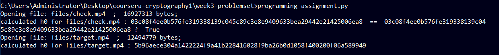

# 引言

单向散列函数又称为消息摘要函数(message)、哈希函数或者杂凑函数，下面会提到哈希函数，他们表示的是同一种东西.单向散列函数的应用极为常见，数字签名^[数字签名耗时较长，因此不可能对整个消息内容直接施加数字签名而是先通过单向散列函数计算出散
列值再对散列值添加数字签名], MD5加密^[现已经攻破]， SHA-1^[2005年由山东大学王小云教授的团队攻破] 等等都能看到应用单向散列函数的影子。单向散列函数生成的散列值又称为文件的“指纹”。参考

假设一个网站存有很大的视频文件*F*，任何人都可以下载。下载该文件的浏览器需要确保该文件内容是和网站上存储的视频文件*F*是一样的，没有被篡改过。那么常见解决该问题的一种方法是事先网站使用单向散列函数计算文件*F*的散列值，然后通过某些验证信道将所得到的散列值*h = H(F)*分发给用户（也可以称为*F* 的数字签名）。浏览器会下载整个文件后检查*H(F)*是否等于真正的散列值h，如果相等，视频是没有发生改动。否则，这意味着整个文件被篡改过. 在现实生活中存在很多像这种的例子。因此在这里将利用密码需所学到的知识，实现对文件Hash 值的计算，借以验证文件是否被篡改过。案例参考

# 设计要求

1. 编写代码来计算的给定文件*F* 的哈希$H_0$
2. 根据现实生活的例子，单向散列函数必须满足以下条件:
    1. 根据任意大小的文件计算出固定长度的*hash* 值
    2. 能够快速计算 *hash* 值
    3. 文件不同，hash 值也不同

# 详细设计
## 整体流程
SHA256 是一种能够根据上限为$2^{64}$ 比特的消息计算出256 比特的散
列值的单向散列函数.

1. 填充

对消息4 进行填充处理，使其长度为512 比特的整数倍，这里的512 比特为一个输入分组

2. 计算$W_0$ ~ $W_{63}$

根据输入分组的521 比特计算出64 个32 比特的值($W_0$ ~ $W_{63}$)

3. 分组处理

对输入分组一次进行64 个步骤的处理（循环次数），让8 个32 比特的值($A$ ~ $H$) 作为SHA256 的内部状态，对所有分组都要进行这一操作。

4. 单步处理

分组处理是由64 个步骤的处理组成的，其中每个步骤都是基于$W_0~W_{63}$ 使内部状态进行复杂变化的处理.

## 详细流程

### SHA256：填充(padding)
输入SHA256 的消息^[可以理解为文件的数据块] 长度应该大于0比特小于$2^{64}$比特。在SHA256中，为了便于后续的处理，在一开始会进行填充操作，这里的填充是指在消息的末尾添加多余的数据，使消息长度成为512 比特的整数倍.

1. 添加1

2. 添加k bit 的0，使得$l+1+k \equiv 448mod512$。保留最后一个分组64bit

3. 添加消息长度，最后一个保留的分组填充原始消息的长度

### SHA256：计算W0~W63

1. 将输入分组的512 比特分为32 比特×16 组，并将它们命为$W_0$ ~ $W_{15}$

2. 余下的48 组用下面的公式表示:

$W_i = \sigma_1(W_i - 2) +W_i - 7 + \sigma_0(W_i - 15) +W_i - 16, 17 \leq i \leq 64$

### SHA256：Hash 计算算法
  
    For i = 1 to N

1. 计算$W_i$  
$$W_i = \begin{cases} W_i, & \text {if 0 $\leq$ i $\leq$ 15} \\ \sigma_1(W_i - 2) +W_i - 7 + \sigma_0(W_i - 15) +W_i - 16,  & \text {if 17 $\leq$ i $\leq$ 64} \end{cases}$$
2. 令
$$(a, b, c, d, e, f, g, h) = (H(t - 1)_1,H(t - 1)2,H(t - 1)_3,H(t - 1)_4,$$
$$H(t - 1)_5,H(t - 1)_6,H(t - 1)_7,H(t - 1)_8)$$
3. 做64 次循环
$$T1 = h + \sum_ {0} (e) + Ch(e, f, g) + K_i +W_i$$
$$T_2 = \sum_ {0} (a) +Maj(a, b, c)$$
$$h = g$$
$$g = f$$
$$f = e$$
$$e = d + T_1$$
$$d = c$$
$$c = b$$
$$b = a$$
$$a = T_1 + T_2$$

4. 重新计算
$$H(t)_1 = H(t-1)_1 + a$$
$$H(t)_2 = H(t-1)_2 + b$$
$$H(t)_3 = H(t-1)_3 + c$$
$$H(t)_4 = H(t-1)_4 + d$$
$$H(t)_5 = H(t-1)_5 + e$$
$$H(t)_6 = H(t-1)_6 + f$$
$$H(t)_7 = H(t-1)_7 + g$$
$$H(t)_8 = H(t-1)_8 + h$$ 
   
~~~~~~~
End for
~~~~~~~
          
          


# 具体实现

在这个项目中，将使用SHA256 作为哈希函数。SHA256 的实施方案使用现有的密码库如PyCrypto^[在这里将使用python 实现，项目地址：https://pypi.python.org/pypi/pycrypto] （Python）的，Crypto（C++）等。

## 导入必要的模块
```{r engine='python',eval=FALSE,highlight=TRUE}
import sys
import os
from Crypto.Hash import SHA256
```
在这里主要用到了Crypto.Hash 模块的SHA256 类，通过调用类接口，实现哈希算法的自定制.

## 完成哈希计算功能
根据哈希计算算法，可以利用PyCrypto 库结合SHA256 算法设计，设计如下：

1. 首先通过读取视频文件，然后利用调用系统函数getsize()获得文件的总大小，然后通过进行分组处理

2. 接着利用前面的哈希算法处理，然后生成8 个32bit 的缓冲区^[也可以叫做分组]。

```{r engine='python',eval=FALSE,highlight=TRUE}
def calculate_hash(file_path, block_size):
    # Get file size in bytes
    file_size = os.path.getsize(file_path)
    # The last block size
    last_block_size = file_size % block_size
    
    
    print "Opening file:",file_path, " ; ",file_size,"bytes; "
    fp = open(file_path, 'rb')
    last_hash = ''
    # read the chuncks
    for chunk in read_reversed_chunks(fp, file_size, last_block_size, block_size):
        # SHA-256 obj
        sha256 = SHA256.new()
        sha256.update(chunk)
        if(last_hash):
            sha256.update(last_hash)
        last_hash = sha256.digest()
    fp.close()
    # Return the last hash (h0)
    return last_hash
```

# 测试

启动程序，读取目标文件的视频文件，然后计算待确认视频的hash值，然后将结果对比，确认视频文件是否被修改过.



